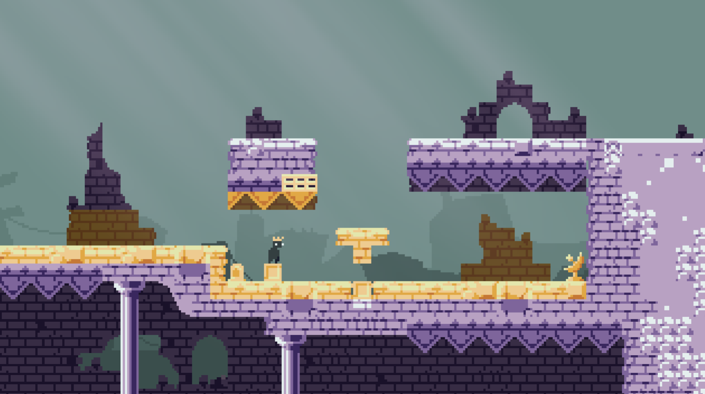
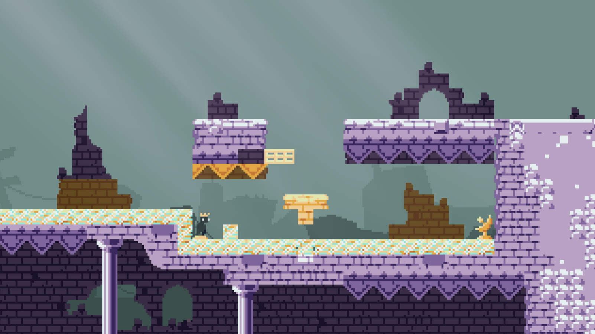

## Overview

_Midas_, originally titled _Touch of Gold_, was a game I created in 48 hours for the 2023 April Fools Gamejam. The theme of the jam was "Fool's Gold", and _Touch of Gold_ won first place for game design.

The general idea of the game was that everything the player touches turns into gold, which has special properties. Gold can conduct electricity to doors and traps, sink in water or weigh things down. Due to the time restraints for the gamejam, only the doors were introduced.

As shown in the photo above, a line of conductive material connects between the button on the left and the receiver on the right. The door on the top remains closed, as there is no power supplied.

Now that the button has been activated and power has been supplied to the receiver, the gate opens.

## Fixing Gamejam Issues

There were several minor problems that I encountered during the gamejam. Primarily, most of the code was written poorly because I didn't expect to continue this project after the jam. To start, the conduction script updated every frame and the crates were being pushed with a one pixel long raycast.

# Crates

Upon updating the script for pushing crates, I realized that Godot was unable to do what I needed it to. I wanted to push one or many crates with an equivalent amount of resistance, so regardless of whether I was pushing one or fifty crates, I would still face the same amount of resistance. A characterbody with a custom script would normally do this just fine, but manually calling move_and_slide() on each of these characterbodies leads to many unwanted collisions, resulting in a jittery mess of crates.

This is essentially unfixable unless I decide to add all of the crates to a single characterbody, but this seems like its far more work that its worth. I was a little disappointed in the engine's limitations, but I've been using Godot for nearly 6 years, and I'm not interested in switching.

This brought me to a point where I need to change my design philosophy. Rather than pushing and pulling crates like in the gamejam version, why not add a method of displacing crates that gives the user more options? I began experimenting, and decided to implement picking up crates and adding them to a stack. The player can then drop the crate on the bottom, or throw the entire stack. Each time you touch a crate, you turn it into gold, but you can pick up a stack of crates from the bottom, turning only the bottom crate into gold. The player can also drop a stack of crates directly in front of them, or charge to throw them across the room.

# Traps

I came to the realization that the game was a little too passive, and I'd like to give an active threat. Currently, the only threat in the game is the player itself. The player either falls into a pit, or they fuck up a level so irrepairably that they're forced to restart.

I decided that it would be fun to add active threats, such as saws or enemies, but I wanted to keep my game as a puzzle game, and I decided to add traps that are activated by electricity. Some traps start disabled, and only enable when the player powers them, while others are enabled the entire time.